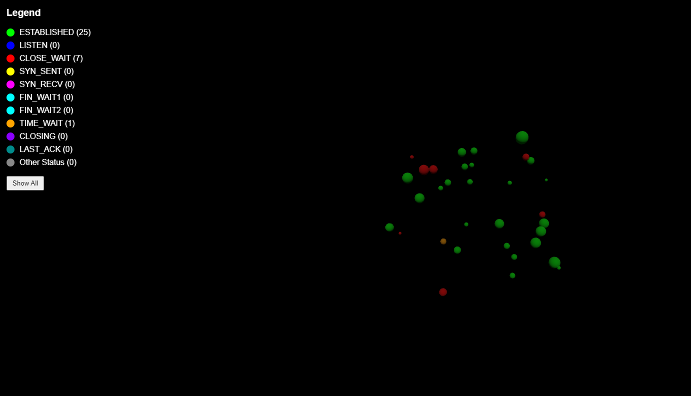

# NetworkBubbles

**NetworkBubbles** è un'applicazione web interattiva che visualizza in tempo reale le connessioni di rete attive sotto forma di bolle 3D. 

## Caratteristiche

- **Visualizzazione 3D**: Le connessioni di rete sono rappresentate come bolle 3D, che fluttuano e si spostano nello spazio.
- **Interattività**: È possibile cliccare sulle bolle per ottenere dettagli sulla connessione, come lo stato, l'indirizzo IP locale e la porta.
- **Filtri**: Filtra le connessioni per stato, utilizzando la legenda sul lato sinistro. 
- **Dati in tempo reale**: Le connessioni di rete vengono aggiornate automaticamente ogni 5 secondi.

## Installazione

- cd backend

    python -m venv venv
    source venv/bin/activate  # Su macOS/Linux
    .\venv\Scripts\activate   # Su Windows
    python app.py

- cd .. (frontend)

    npm install
    npm start

    

